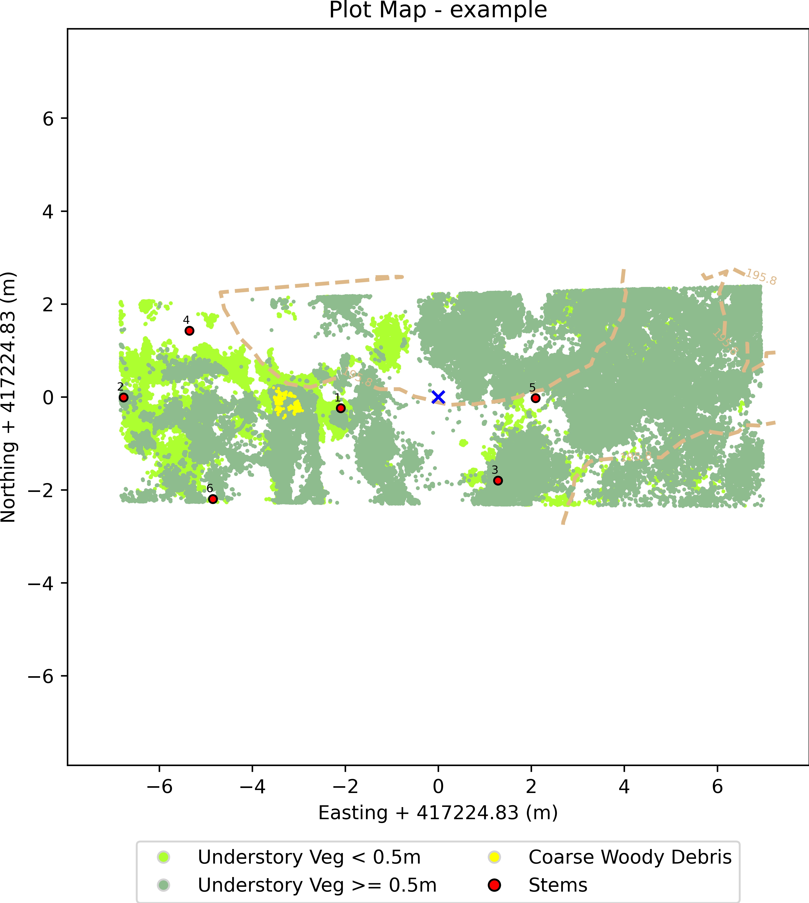

Forest Structural Complexity Tool - Plot Report
===============================================

# 

## Point Cloud Filename: example.las

## Plot Centre (Local coords): X: 417224.83 m, Y: 417224.83 m

## Plot Area: 0.008 ha

## Stems/ha:  776

## Mean DBH: 0.32 m

## Median DBH: 0.241 m

## Min DBH: 0.135 m

## Max DBH: 0.603 m

## Total Plot Stem Volume 1: 12.452 m3

## Total Plot Stem Volume 2: 6.705 m3

## FSCT Processing Time: 18.2 minutes

